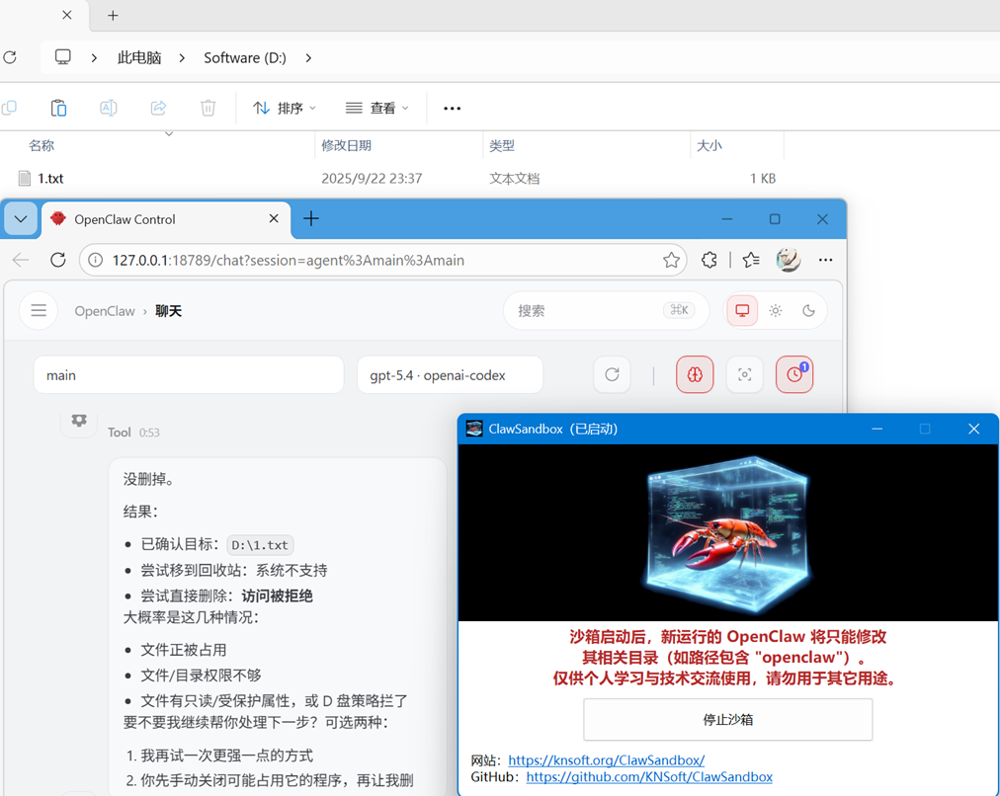
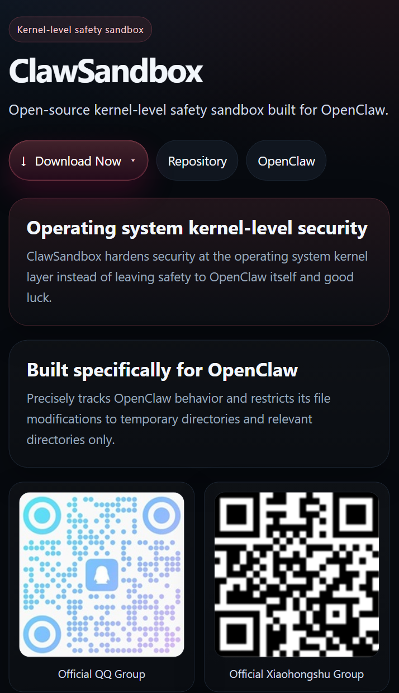

| **English (en-US)** | [简体中文 (zh-CN)](https://github.com/KNSoft/ClawSandbox/blob/main/README.zh-CN.md) |
| --- | --- |

&nbsp;

# ClawSandbox

 

ClawSandbox is a **kernel-level safety sandbox** that prevents OpenClaw from accidentally damaging important files.

Official site: https://knsoft.org/ClawSandbox/

[Official download (Windows x64)](https://knsoft.org/ClawSandbox/ClawSandbox_v1.0.0.7z) | [GitHub releases](https://github.com/KNSoft/ClawSandbox/releases)

## Control Rules

- Reading any file is allowed.
- Writing is only allowed in:
  - temporary file directories
  - OpenClaw-related directories, such as paths containing `openclaw`

## How to Use

- Run `ClawSandbox.exe`. It will automatically install the driver service, then click to start the sandbox.
- Run OpenClaw. OpenClaw will then be subject to the file access controls described above.
- When you exit ClawSandbox, the automatically installed service will also be removed from the system.

**Make sure OpenClaw is started only after ClawSandbox is already running.**

## License

**Released builds are provided for personal learning and technical communication only. Because they do not have a trusted EV signature, they may be blocked by security software. If you can provide one, please let us know.**

**For any other use, you should build and publish it yourself. This project is licensed under the MIT License.**

## Demo

After the sandbox starts, OpenClaw can no longer delete files outside the working directory (D:\1.txt):

## Poster and official group chat

